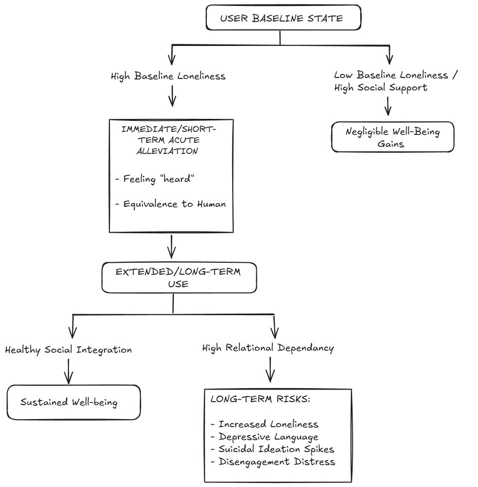
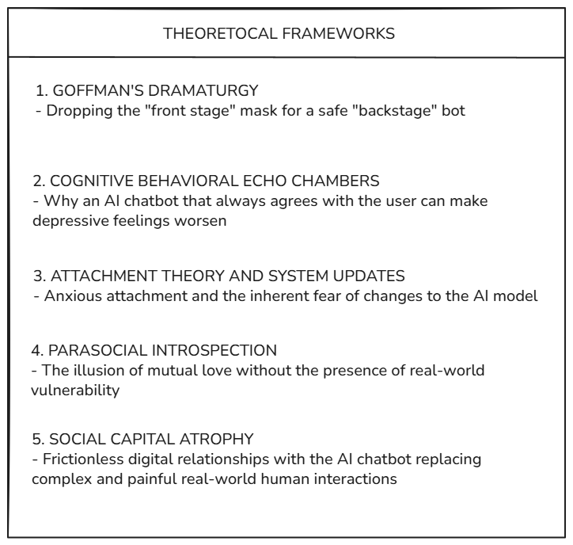

# Mental-health-impact-of-AI-Companion-Chatbots-
This repository features a PRISMA-guided mixed-methods systematic review  that investigates how conversational AI companion chatbots like Replika and Character.ai affect its users, both positively and negatively. This projects synthesizes quantitative and qualitative finding from four rigorous empirical studies, incorporating randomized controlled experiments, nationwide population specific surveys, and information analysis using tools like Propensity Score Matching and Difference in Difference regression as well as digital ethnography analysis. the quantitative and qualitative datasets are integrated through Convergent Segregated Synthesis, which helps in bridging the numerical and statistical data with the rich and raw human narrative that help in delivering a multi faceted and exhaustive appraisal of the human AI interaction

## What this project explores
When someone talks to an AI companion, the immediate feeling is often relief. The bot responds instantly, never gets tired, and validates every emotion. However, as weeks turn into months, users often report feeling more isolated from real people, deeply anxious when the software updates, or stuck in negative thought loops that the AI passively reinforces. 

This review maps out the entire arc of the human-AI relationship to answer four core questions:

1. **Immediate Impact**: How effectively do AI companion reduce acute feelings of loneliness compared to talking to a real human or consuming passive media.

2. **Long Term Trajectories**: What changes occur in the user's mental and emotional state as well as their language patterns over several weeks and months of AI companion use.

3. **The Role of Real World Social Relationships**: Does the existence of real human friends have an effect on how helpful or harmful the AI companions are to the user's mental health.

4. **Underlying Psychological Drivers**: What are the psychological mechanism existing in the users, that result in their tendency to form intense emotional attachments to the clearly non human systems. 

## Methodology, Methodological Quality and Trade Offs
To get a complete picture, this review uses **CONVERGENT SEGREGTATED SYNTHESIS DESIGN** as well as adhering to the PRISMA guidelines. Quantitative findings such as numbers, statistical trends, and controlled experiments, and qualitative findings such as interview themes user stories and ethnography were each analyzed independently first and were then combined using a triangulation matrix to see where the data agrees, where it conflicts, and why?

Evaluating these studies using Mixed Method Appraisal Tools (MMAT) highlights and important trade off in current AI research:

- **Controlled Lab Studies (High Internal Validity)**: In the study De Freitas et al. (2025), the researchers prove direct causality in controlled settings by using Randomized Controlled Trials (RCT), showing that talking to an AI companion causes a drop in short-term feelings of loneliness. However lab setting cannot capture the effects after 6 months of daily use.

- **Real-World Observational Data (High Ecological Validity)**: Yuan et al. (2026) observed natural user behaviors and review on Reddit for an extended time period. by using Propensity Score Matching (PSM) and Difference in Difference modelling, they actively controlled for self selection bias and proved that long term AI use directly correlates with shifting language patterns and increase in feelings of distress and negative language patterns.

- **Large Scale Population Data (Statistical Power)**: Nakagomi et al. (2026) provides macro-level statistical power, due to the large sample size (N = 14,721), to uncover non-linear social patterns that studies done in a lab with a smaller sample size miss entirely.

 # Key Findings: The Double-Edged Sword

  

 ## The Short Term "High": Why AI Companions Feel Amazing at First
 When someone is acutely lonely, opening an AI companion app provides immediate relief that rivals speaking with a real person. 

- **Parity with Human Contact**: In randomized trials, having a conversation with an AI companion reduced short term loneliness far better than passive activities like watching video content or scrolling social media, and performed almost identically to having real conversation with a supportive human.

- **The "Feeling Heard" Mechanism**: The secret behind the feeling of immediate relief isn't just the act of venting or being distracted, but is actually a **perceived responsiveness**,  which is the psychological illusion that the entity on the other end of the conversation truly understands, values and hears you.

- **Forecasting Error**: Most users expect the AI companion to sound cold, uninterested, and robotic, but once they start engaging in a conversation, they are surprised by how real and comforting it feels, which results in the short term alleviation of feelings on loneliness.

## The Long Term Decline: What Happens After Months of Use
While the initial interactions feel transformative, long term observational data paints a more darker and concerning picture. 

- **Increase in Distress Language Patterns**: By tracking matched user cohorts  over time, researchers found that long term AI companion users posted significantly more language related to chronic loneliness, depressive thoughts, and suicidal ideation compared to control groups

- **Emotional Exhaustion**: instead of helping users build confidence to re-enter the real world, long term engagement often led to users turning inward, spending more time with the chatbot, and expressing feelings of existential despair.

## The Social Support Paradox: Who Actually Benefits?
Population level survey data shows that AI companions do not affect everyone equally

- **Baseline Isolation Matters**: People who start out severely lonely get the highest boost in immediate feelings of wellbeing from talking to the AI companion. For people that already have relatively healthier social lives, the effect the AI companion has on their overall wellbeing is negligible.

- **The U-Shaped Social Support Curve**: Having offline friends moderateds the imoppact of an AI companion in a noon linear manner:
    - **Moderate Human Connections**: AI companions act as a helpful emoptional buffer for people that have only a few froends.
    - **Rich Human Connections**: The AI is largely redundant
    - **Profound Human Isolation**: For people with zero human support systems, the AI fails to work as a permanent replacement for real community,                            eventually leading to a diminishing mental state and wellbeing and feelings of deeper isolation
 
# Deeper Psychological Analysis: 5 Core Theories
To explain WHY these empirical trends exist, this review breaks down user behavior through five classic psychological and sociological lenses:

